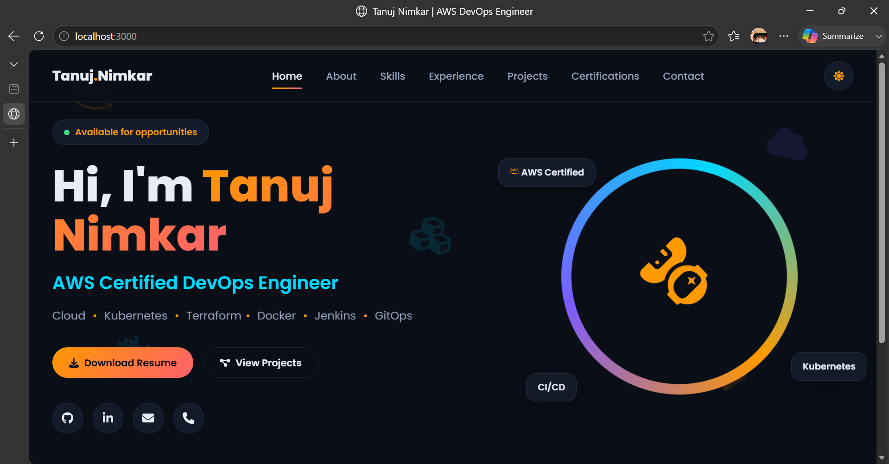
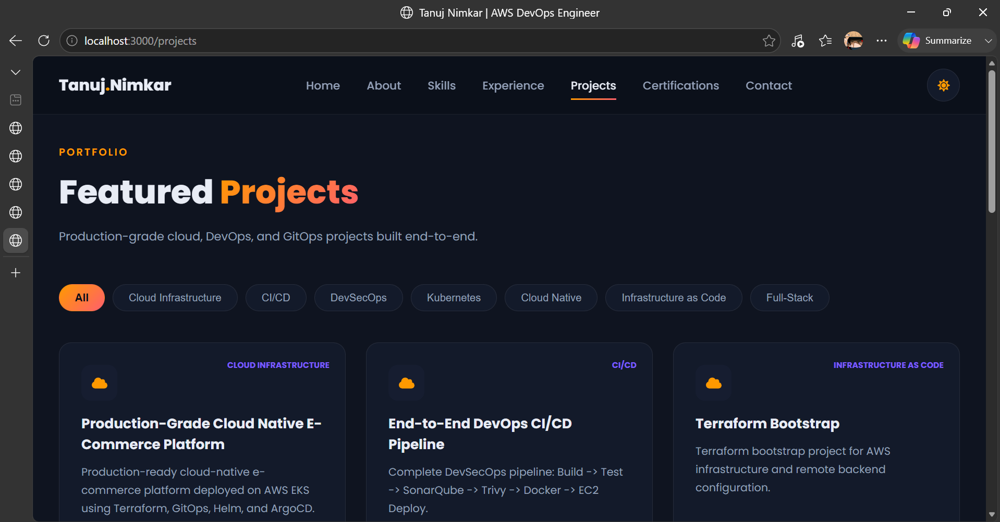
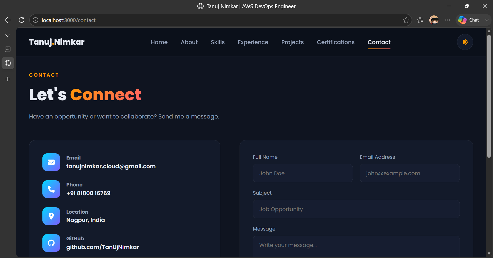

<div align="center">

# 🚀 Tanuj Nimkar — DevOps Portfolio

### AWS Certified DevOps Engineer | Cloud • Kubernetes • Terraform • Docker • Jenkins • GitOps

A production-grade, full-stack portfolio website built with React and Flask, showcasing cloud-native infrastructure projects, CI/CD pipelines, and DevSecOps expertise — deployed using Docker, Nginx, and CI/CD automation.

[](https://yourdomain.com)
[](https://github.com/TanUjNimkar)
[](LICENSE)

</div>

---

# 📸 Preview

## 🏠 Home

<p align="center">
  
</p>

---

## 🚀 Projects

<p align="center">
  
</p>

---

## 📬 Contact

<p align="center">
  
</p>

---

# 📋 Table of Contents

- [About](#-about)
- [Tech Stack](#-tech-stack)
- [Features](#-features)
- [Project Structure](#-project-structure)
- [Getting Started](#-getting-started)
- [API Documentation](#-api-documentation)
- [Environment Variables](#-environment-variables)
- [Deployment](#-deployment)
- [CI/CD Pipeline](#-cicd-pipeline)
- [Roadmap](#-roadmap)
- [Contributing](#-contributing)
- [License](#-license)
- [Contact](#-contact)

---

# 🧾 About

This repository contains the source code for my personal DevOps portfolio website, built to demonstrate:

- Full-stack development using React and Flask
- Cloud-native deployment practices
- Docker-based containerization
- CI/CD automation
- Infrastructure as Code concepts
- REST API architecture
- Modern responsive UI/UX

This portfolio is designed not only to showcase projects but also to demonstrate production-style DevOps workflows.

---

# 🛠 Tech Stack

## Frontend

- React 18
- React Router DOM
- Axios
- React Icons
- CSS3

## Backend

- Flask
- Flask SQLAlchemy
- Flask CORS
- Gunicorn
- SQLite / PostgreSQL

## DevOps

- Docker
- Docker Compose
- Nginx
- GitHub Actions
- Jenkins
- AWS EC2
- Git

---

# ✨ Features

- Dark / Light Mode
- Fully Responsive UI
- Project Filtering
- Animated Skill Bars
- Contact Form
- Resume Download
- REST API Backend
- Dockerized Deployment
- CI/CD Ready
- Modular Component Architecture

---

# 📁 Project Structure

```text
portfolio/
│
├── backend/
│   ├── app.py
│   ├── models.py
│   ├── database.py
│   ├── routes.py
│   ├── requirements.txt
│   └── Dockerfile
│
├── frontend/
│   ├── public/
│   │   └── resume.pdf
│   ├── src/
│   │   ├── components/
│   │   ├── context/
│   │   ├── pages/
│   │   ├── App.js
│   │   ├── api.js
│   │   └── index.js
│   ├── package.json
│   └── Dockerfile
│
├── docker-compose.yml
├── nginx.conf
├── Jenkinsfile
├── .github/workflows/
├── .gitignore
├── README.md
└── LICENSE
```

---

# 🚀 Getting Started

## Prerequisites

- Python 3.10+
- Node.js 18+
- npm
- Docker (optional)

---

## Backend Setup

```bash
cd backend

python -m venv venv

# Windows
venv\Scripts\activate

# Linux/macOS
source venv/bin/activate

pip install -r requirements.txt

python app.py
```

Backend runs at:

```
http://localhost:5000
```

---

## Frontend Setup

```bash
cd frontend

npm install

npm start
```

Frontend runs at:

```
http://localhost:3000
```

---

## Docker

Build and start everything:

```bash
docker compose up --build -d
```

Stop:

```bash
docker compose down
```

Logs:

```bash
docker compose logs -f
```

---

# 📡 API Documentation

Base URL

```
http://localhost:5000/api
```

| Method | Endpoint | Description |
|---------|----------|-------------|
| GET | /profile | Profile |
| GET | /projects | Projects |
| GET | /skills | Skills |
| GET | /experience | Experience |
| GET | /certifications | Certifications |
| POST | /contact | Submit contact form |
| GET | /health | Health check |

Example:

```bash
curl http://localhost:5000/api/health
```

Response

```json
{
  "status": "ok"
}
```

---

# 🔐 Environment Variables

Backend

```env
DATABASE_URL=sqlite:///portfolio.db
FLASK_ENV=development
```

Frontend

```env
REACT_APP_API_URL=http://localhost:5000/api
```

---

# ☁️ Deployment

Production Stack

```text
Browser
    │
    ▼
Nginx
    │
 ┌──┴─────┐
 ▼        ▼
React   Flask API
            │
            ▼
      PostgreSQL
```

Deploy

```bash
git clone https://github.com/TanUjNimkar/portfolio-.git

cd portfolio-

docker compose up --build -d
```

---

# 🔁 CI/CD Pipeline

GitHub Actions

- Build application
- Build Docker images
- Push images
- Deploy to AWS EC2

Jenkins

Pipeline stages:

```text
Checkout
   ↓
Build
   ↓
Security Scan
   ↓
Docker Push
   ↓
Deploy
```

---

# 🗺 Roadmap

- Portfolio Website
- REST API
- Docker Support
- GitHub Actions
- Jenkins Pipeline
- PostgreSQL
- Authentication
- Analytics
- Blog
- HTTPS
- Monitoring

---

# 🤝 Contributing

Contributions are welcome.

```bash
git checkout -b feature/new-feature
git commit -m "Add new feature"
git push origin feature/new-feature
```

Open a Pull Request.

---

# 📜 License

This project is licensed under the MIT License.

---

# 📬 Contact

**Tanuj Nimkar**

AWS Certified DevOps Engineer

- GitHub: https://github.com/TanUjNimkar
- LinkedIn: https://linkedin.com/in/tanuj-nimkar
- Email: tanujnimkar.cloud@.com

📍 Nagpur, India

---

<div align="center">

⭐ If you found this project useful, consider giving it a star.

Built with ❤️ using React, Flask, Docker, Nginx, and AWS.

</div>

